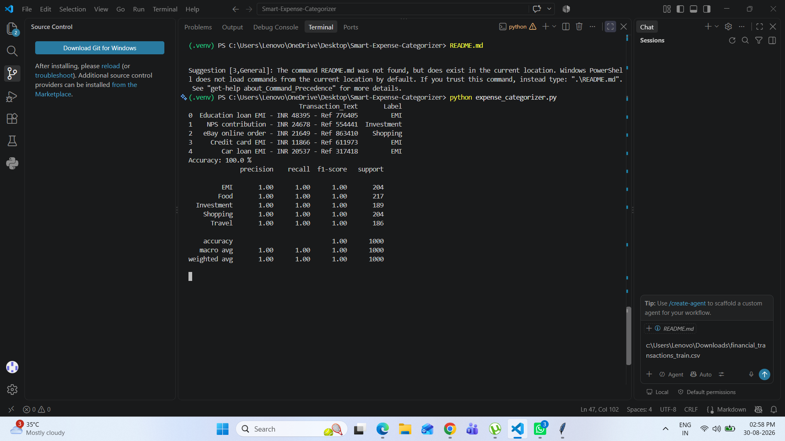

# Smart Expense Categorizer

## About

This project uses Machine Learning to classify
financial transaction text into different expense categories.

## Categories

- Food
- Travel
- Shopping
- Investment
- EMI

## Technologies Used

- Python
- Pandas
- Scikit-learn
- TF-IDF
- Logistic Regression
- Matplotlib
- Seaborn

## Dataset

The dataset contains financial transaction text
and corresponding expense labels.

## Machine Learning Method

Transaction Text
→ TF-IDF
→ Logistic Regression
→ Expense Category

## How to Run

Install the required libraries:

pip install -r requirements.txt

Run:

python expense_categorizer.py# Smart-Expense-Categorizer
Machine Learning project that categorizes financial transactions using TF-IDF and Logistic Regression
## Project Results

